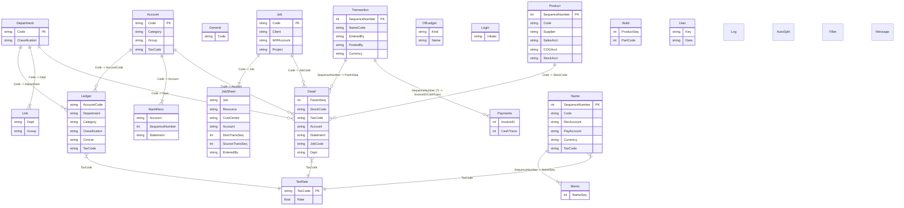

This is an approximate ERD of the MoneyWorks database schema, based on
[this image](https://secure.cognito.co.nz/manual/moneyworks_appendix_simplified_schema.html).

```mermaid
erDiagram

    %% Entities
    Account {
        string Code PK
        string Category
        string Group
        string TaxCode
    }

    Ledger {
        string AccountCode
        string Department
        string Category
        string Classification
        string Concat
        string TaxCode
    }

    Department {
        string Code PK
        string Classification
    }

    Link {
        string Dept
        string Group
    }

    General {
        string Code
    }

    BankRecs {
        string Account
        int SequenceNumber
        string Statement
    }

    Job {
        string Code PK
        string Client
        string WIPAccount
        string Project
    }

    JobSheet {
        string Job
        string Resource
        string CostCentre
        string Account
        int DestTransSeq
        int SourceTransSeq
        string EnteredBy
    }

    Detail {
        int ParentSeq
        string StockCode
        string TaxCode
        string Account
        string Statement
        string JobCode
        string Dept
    }

    Transaction {
        int SequenceNumber PK
        string NameCode
        string EnteredBy
        string PostedBy
        string Currency
    }

    Payments {
        int InvoiceID
        int CashTrans
    }

    Name {
        int SequenceNumber PK
        string Code
        string RecAccount
        string PayAccount
        string Currency
        string TaxCode
    }

    Memo {
        int NameSeq
    }

    OffLedger {
        string Kind
        string Name
    }

    Login {
        string Initials
    }

    Product {
        int SequenceNumber PK
        string Code
        string Supplier
        string SalesAcct
        string COGAcct
        string StockAcct
    }

    Build {
        int ProductSeq
        int PartCode
    }

    TaxRate {
        string TaxCode PK
        float Rate
    }

    User {
        string Key
        string Data
    }

    Log {
        
    }

    AutoSplit {
        
    }

    Filter {
        
    }

    Message {
        
    }

    %% Relationships

    %% Account -> Ledger
    Account ||--o{ Ledger : "Code -> AccountCode"

    %% Department -> Ledger
    Department ||--o{ Ledger : "Code -> Department"

    %% Department -> Link
    Department ||--|{ Link : "Code -> Dept"

    %% Account -> BankRecs
    Account ||--|{ BankRecs : "Code -> Account"

    %% Job -> JobSheet
    Job ||--|{ JobSheet : "Code -> Job"

    %% Transaction -> Detail
    Transaction ||--o{ Detail : "SequenceNumber -> ParentSeq"

    %% Job -> Detail
    Job ||--o{ Detail : "Code -> JobCode"

    %% Department -> Detail
    Department ||--o{ Detail : "Code -> Dept"

    %% Account -> Detail
    Account ||--o{ Detail : "Code -> Account"

    %% Product -> Detail (StockCode)
    Product ||--o{ Detail : "Code -> StockCode"

    %% Transaction -> Payments (assuming)
    Transaction ||--o{ Payments : "SequenceNumber (?) -> InvoiceID/CashTrans"

    %% Name -> Memo
    Name ||--|{ Memo : "SequenceNumber -> NameSeq"

    %% Any table with TaxCode references TaxRate
    Ledger }|--|| TaxRate : "TaxCode"
    Detail }|--|| TaxRate : "TaxCode"
    Name }|--|| TaxRate : "TaxCode"

    %% (Product, Account, etc. could reference TaxRate if needed)
```
